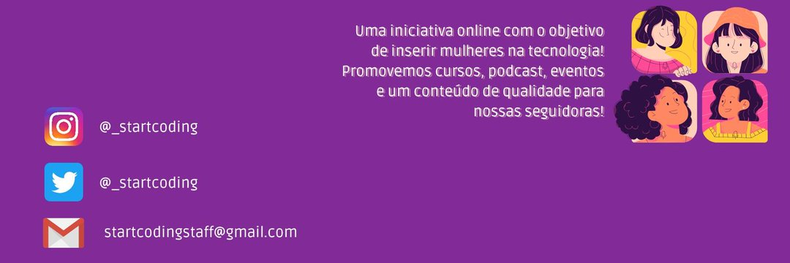

***********

## Sobre Nós

Start Coding é uma iniciativa que tem como objetivo inserir mulheres no setor da tecnologia e apoiar as que já estão, empoderando-as e oferecendo mais oportunidades de conhecimento.

## O que nós fazemos

- Conteúdo para mídias sociais;
- Podcast;
- Eventos;
- Cursos.

## Quer conhecer tudo isso? Segue a gente por aqui 👇

***********

